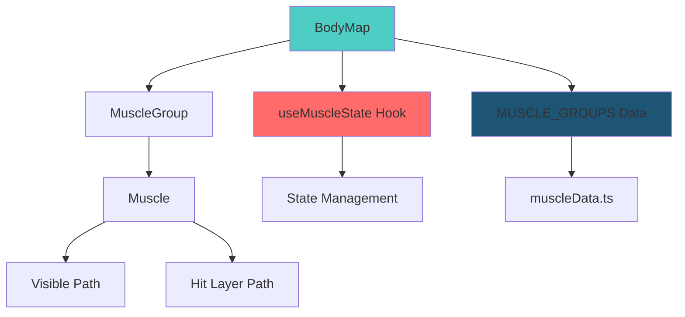
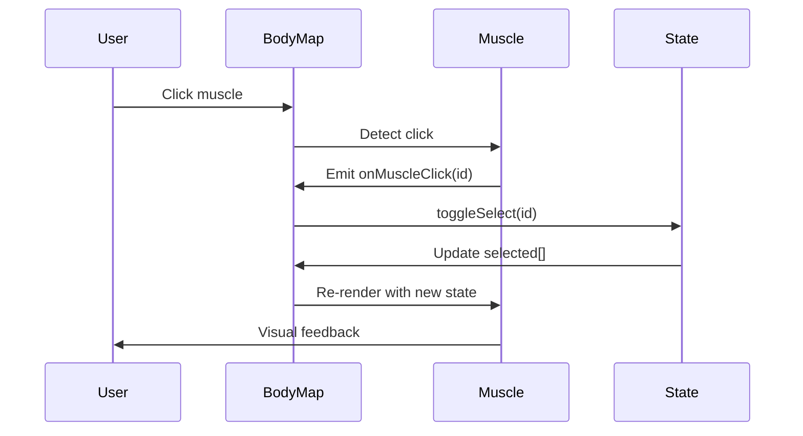
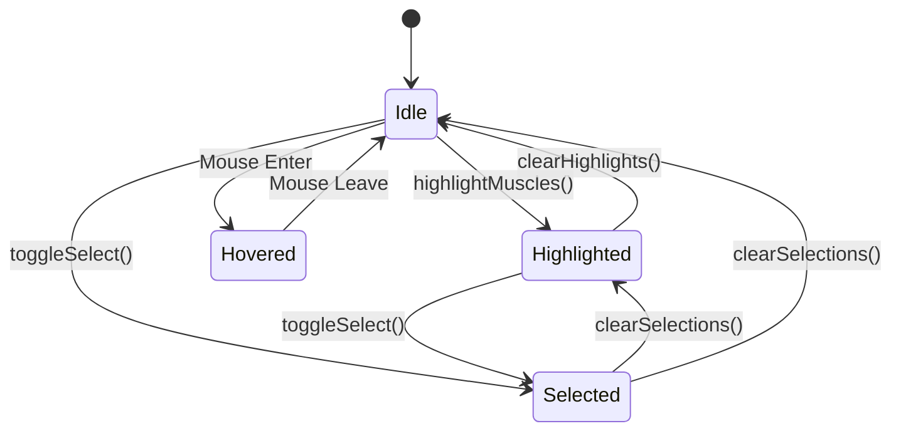

# 🏋️ Dynamic Body Muscle

An interactive, lightweight React component library for visualizing and selecting body muscles. Perfect for fitness apps, workout planners, physiotherapy tools, and anatomy education.

[](https://www.typescriptlang.org/)
[](https://reactjs.org/)
[](LICENSE)

## ✨ Features

- 🎯 **Dual Interaction Modes**: Click-based selection or programmatic control
- 🔄 **Smart Muscle Pairing**: Automatically sync left/right muscle groups
- 🎨 **Customizable Styling**: Override colors, opacity, and visual states
- 📱 **Responsive**: Works on desktop and mobile
- 🪶 **Lightweight**: Zero dependencies (just React)
- 🔒 **Type-Safe**: Full TypeScript support
- 🌳 **Tree-Shakeable**: Import only what you need
- ♿ **Accessible**: Proper hover states and keyboard support

---

## 📦 Installation

```bash
npm install dynamic-body-muscle-map
# or
yarn add dynamic-body-muscle-map
# or
pnpm add dynamic-body-muscle-map
```

---

## 🚀 Quick Start

```tsx
import { BodyMap, useMuscleState } from 'dynamic-body-muscle-map';

function App() {
	const { selected, toggleSelect } = useMuscleState();

	return (
		<BodyMap
			selected={selected}
			interactive={true}
			onMuscleClick={toggleSelect}
		/>
	);
}
```

---

## 📖 API Reference

### `<BodyMap>`

The main component for rendering the interactive body muscle map.

#### Props

| Prop            | Type                             | Default        | Description                                                        |
| --------------- | -------------------------------- | -------------- | ------------------------------------------------------------------ |
| `highlighted`   | `MuscleId[]`                     | `[]`           | Array of muscle IDs to highlight                                   |
| `selected`      | `MuscleId[]`                     | `[]`           | Array of muscle IDs to mark as selected                            |
| `interactive`   | `boolean \| MuscleId[]`          | `true`         | Enable click interaction (true/false or array of specific muscles) |
| `onMuscleClick` | `(id: MuscleId) => void`         | -              | Callback when a muscle is clicked                                  |
| `onMuscleHover` | `(id: MuscleId \| null) => void` | -              | Callback when a muscle is hovered                                  |
| `showHitLayers` | `boolean`                        | `false`        | Show invisible hit detection layers (debug)                        |
| `styles`        | `MuscleStyles`                   | Default styles | Custom styles for different muscle states                          |
| `className`     | `string`                         | `''`           | Additional CSS class for the SVG container                         |

#### Example

```tsx
<BodyMap
	highlighted={['RightBicep', 'LeftBicep']}
	selected={['RightQuad']}
	interactive={['RightBicep', 'LeftBicep', 'Chest']}
	onMuscleClick={(id) => console.log('Clicked:', id)}
	onMuscleHover={(id) => console.log('Hovered:', id)}
	showHitLayers={false}
	styles={{
		highlighted: { fill: '#ff6b6b', opacity: 0.8 },
		selected: { fill: '#4ecdc4', opacity: 0.9 },
	}}
/>
```

---

### `useMuscleState()`

A React hook for managing muscle selection state.

#### Returns

| Property           | Type                        | Description                                 |
| ------------------ | --------------------------- | ------------------------------------------- |
| `highlighted`      | `MuscleId[]`                | Currently highlighted muscles               |
| `selected`         | `MuscleId[]`                | Currently selected muscles                  |
| `toggleHighlight`  | `(id: MuscleId) => void`    | Toggle highlight for a single muscle        |
| `highlightMuscles` | `(ids: MuscleId[]) => void` | Set highlighted muscles (replaces existing) |
| `clearHighlights`  | `() => void`                | Clear all highlights                        |
| `toggleSelect`     | `(id: MuscleId) => void`    | Toggle selection for a single muscle        |
| `selectMuscles`    | `(ids: MuscleId[]) => void` | Set selected muscles (replaces existing)    |
| `clearSelections`  | `() => void`                | Clear all selections                        |
| `reset`            | `() => void`                | Clear both highlights and selections        |

#### Example

```tsx
const {
  selected,
  toggleSelect,
  selectMuscles,
  clearSelections,
} = useMuscleState();

// Toggle individual muscle
<button onClick={() => toggleSelect('RightBicep')}>
  Toggle Right Bicep
</button>

// Select multiple muscles
<button onClick={() => selectMuscles(['RightBicep', 'LeftBicep'])}>
  Select Both Biceps
</button>

// Clear all
<button onClick={clearSelections}>Clear All</button>
```

---

## 🎨 Custom Styling

Override default styles for different muscle states:

```tsx
const customStyles = {
	default: {
		fill: '#c2c2c2',
		opacity: 1,
	},
	highlighted: {
		fill: '#ff0000',
		opacity: 0.8,
		stroke: '#000000',
		strokeWidth: 2,
	},
	selected: {
		fill: '#00ff00',
		opacity: 0.9,
		stroke: '#ffffff',
		strokeWidth: 3,
	},
	hovered: {
		fill: '#0000ff',
		opacity: 0.85,
	},
	disabled: {
		fill: '#999999',
		opacity: 0.5,
	},
};

<BodyMap styles={customStyles} />;
```

---

## 🔧 Utility Functions

### `getMuscleById(id: string)`

Get muscle data by ID.

```tsx
import { getMuscleById } from 'dynamic-body-muscle-map';

const muscle = getMuscleById('RightBicep');
console.log(muscle.name); // "Right Bicep"
console.log(muscle.group); // "RightArm"
```

### `getMusclesByGroup(groupName: string)`

Get all muscles in a group.

```tsx
import { getMusclesByGroup } from 'dynamic-body-muscle-map';

const armMuscles = getMusclesByGroup('RightArm');
console.log(armMuscles); // [{ id: 'RightBicep', ... }, ...]
```

### `getPairedMuscle(id: string)`

Get the paired muscle (left ↔ right).

```tsx
import { getPairedMuscle } from 'dynamic-body-muscle-map';

const paired = getPairedMuscle('RightBicep');
console.log(paired); // "LeftBicep"
```

---

## 💡 Usage Examples

### Click Mode (Interactive)

```tsx
import { BodyMap, useMuscleState } from 'dynamic-body-muscle-map';

function InteractiveExample() {
	const { selected, toggleSelect, clearSelections } = useMuscleState();

	return (
		<div>
			<BodyMap
				selected={selected}
				interactive={true}
				onMuscleClick={toggleSelect}
			/>
			<button onClick={clearSelections}>Clear Selection</button>
			<p>Selected: {selected.join(', ')}</p>
		</div>
	);
}
```

### Programmatic Mode (Controlled)

```tsx
import { BodyMap } from 'dynamic-body-muscle-map';
import { useState } from 'react';

function ProgrammaticExample() {
	const [highlighted, setHighlighted] = useState(['RightBicep', 'LeftBicep']);

	return (
		<div>
			<BodyMap highlighted={highlighted} interactive={false} />
			<button onClick={() => setHighlighted(['Chest', 'AbsUpper'])}>
				Highlight Chest & Abs
			</button>
		</div>
	);
}
```

### Mixed Mode (Partial Interaction)

```tsx
import { BodyMap, useMuscleState } from 'dynamic-body-muscle-map';

function MixedExample() {
	const { selected, toggleSelect } = useMuscleState();
	const [highlighted] = useState(['Chest', 'AbsUpper']);

	return (
		<BodyMap
			highlighted={highlighted}
			selected={selected}
			interactive={['RightBicep', 'LeftBicep']} // Only biceps clickable
			onMuscleClick={toggleSelect}
		/>
	);
}
```

### Muscle Pairing

```tsx
import {
	BodyMap,
	useMuscleState,
	getPairedMuscle,
} from 'dynamic-body-muscle-map';

function PairingExample() {
	const { selected, toggleSelect } = useMuscleState();
	const [syncPairs, setSyncPairs] = useState(true);

	const handleMuscleClick = (muscleId) => {
		toggleSelect(muscleId);

		if (syncPairs) {
			const paired = getPairedMuscle(muscleId);
			if (paired) toggleSelect(paired);
		}
	};

	return (
		<div>
			<label>
				<input
					type='checkbox'
					checked={syncPairs}
					onChange={(e) => setSyncPairs(e.target.checked)}
				/>
				Sync Muscle Pairs
			</label>

			<BodyMap
				selected={selected}
				interactive={true}
				onMuscleClick={handleMuscleClick}
			/>
		</div>
	);
}
```

---

## 🏗️ Architecture

### Component Structure



### Data Flow



### State Management



---

## 🗂️ Available Muscles

### Arms

- `RightBicep` / `LeftBicep`
- `RightForearm` / `LeftForearm`
- `RightShoulder` / `LeftShoulder`

### Torso

- `Chest`
- `AbsUpper`
- `AbsLower`
- `RightAbsObliques` / `LeftAbsObliques`

### Legs

- `RightQuad` / `LeftQuad`
- `RightCalf` / `LeftCalf`
- `RightAdductor` / `LeftAdductor`

---

## 🛠️ Development

### Adding Custom SVG

1. Place your SVG in `src/assets/body-map-[gender]_[view].svg`
2. Run the parser: `npx tsx scripts/parse-svg.ts`
3. Generated files:
   - `src/types/muscles.ts` - TypeScript types
   - `src/utils/muscleData.ts` - Muscle data & pairs

### SVG Requirements

- Each muscle should be a `<path>` element with a unique `id`
- Optional: Add `[MuscleID]_Hit` paths for better click detection
- Group muscles using `<g id="[GroupName]Group">`

Example:

```xml
<g id="RightArmGroup">
  <path id="RightBicep" d="M..." fill="#c2c2c2" />
  <path id="RightBicep_Hit" d="M..." fill="transparent" opacity="0" />
</g>
```

---

## 📊 Bundle Size

| Package        | Size (gzipped) |
| -------------- | -------------- |
| Core Component | ~8 KB          |
| Full Library   | ~15 KB         |

---

## 🗺️ Roadmap

- [ ] Back view support
- [ ] Male/Female body variations
- [ ] Animation transitions
- [ ] Preset workout configurations
- [ ] Export/Import muscle selections
- [ ] Touch gestures for mobile
- [ ] Accessibility improvements (ARIA labels)

---

## 🤝 Contributing

Contributions are welcome! Please read our [Contributing Guide](CONTRIBUTING.md) for details. //Still pending at the moment...

1. Fork the repository
2. Create your feature branch (`git checkout -b feature/AmazingFeature`)
3. Commit your changes (`git commit -m 'Add some AmazingFeature'`)
4. Push to the branch (`git push origin feature/AmazingFeature`)
5. Open a Pull Request

---

## 📄 License

MIT © Joseph Scafidi

---

## 🙏 Acknowledgments

- SVG assets based on anatomical references
- Built with React, TypeScript, and Vite
- Inspired by fitness and physiotherapy applications

---

## 📬 Support

- 🐛 [Report a Bug](https://github.com/JScafidi616/Dynamic-Body-muscle/issues)
- 💡 [Request a Feature](https://github.com/JScafidi616/Dynamic-Body-muscle/issues)
- 📧 Email: jscafidi616@hotmail.com

---

**Made with ❤️ for the fitness and health community**
